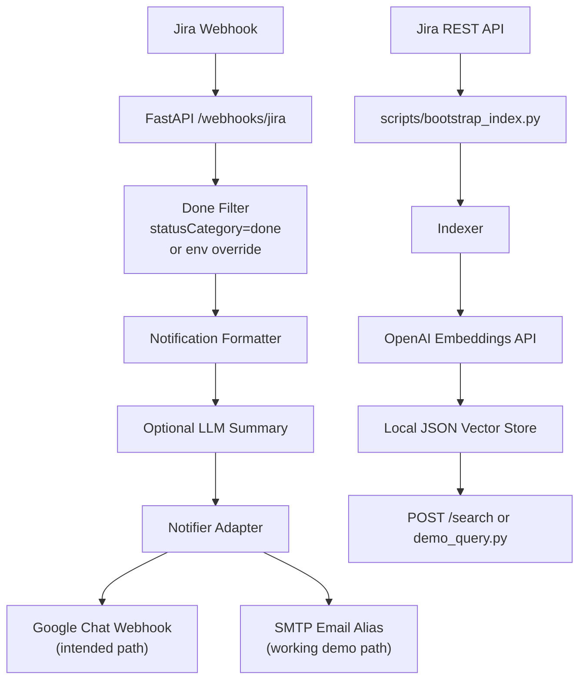

# MindFriend Architecture

## Overview

This repo implements the two required MindFriend flows with a deliberately small runtime:

1. Jira sends a webhook when an issue changes.
2. The FastAPI service filters for tickets that actually reached a terminal `Done` state.
3. The service formats a short notification and delivers it to a collaboration channel.
4. A separate indexing flow pulls Jira tickets, creates OpenAI embeddings, stores them locally, and serves semantic search over that index.

The working demo path uses email delivery through Gmail SMTP because the current Google Chat incoming webhook path is blocked by workspace policy. Google Chat still remains in the architecture because it is the intended primary collaboration channel from the assignment.

## System Flow

## Runtime Components

- `app/main.py`
  Creates the FastAPI app and wires the runtime services.
- `app/routes/webhooks.py`
  Receives Jira webhooks, requires the shared secret, and triggers notification delivery.
- `app/routes/search.py`
  Accepts natural-language search requests and returns semantically ranked tickets.
- `app/services/jira_client.py`
  Pulls Jira tickets through REST and retries Jira rate-limit responses.
- `app/services/jira_events.py`
  Converts Jira webhook payloads and Atlassian Document Format descriptions into plain text.
- `app/services/notifier.py`
  Formats short updates, optionally calls the LLM summary step, and delivers to Google Chat or SMTP email.
- `app/services/indexer.py`
  Normalizes Jira issues, requests embeddings, and writes the local index.
- `app/store/vector_store.py`
  Persists embeddings and metadata in an inspectable local JSON file and runs cosine similarity search.

## Why These Tools

- FastAPI
  Small, testable, and enough for one webhook endpoint plus one search endpoint.
- Jira REST API
  Direct integration keeps the data path explainable and avoids extra orchestration layers.
- OpenAI embeddings API
  Makes the semantic search genuinely semantic instead of keyword-only.
- Local JSON vector store
  Easy to inspect during review and avoids extra infrastructure for a take-home.
- Gmail SMTP
  Works in the current environment and proves the delivery flow end-to-end.
- Optional Google Chat webhook adapter
  Keeps the design aligned with the assignment, even though the current workspace blocks that path.

## Required LLM API Usage

The `LLM API` is explicit in two places:

- Embeddings are mandatory for semantic retrieval and are used during indexing and query time.
- Prompt-based summarization is optional for notifications and can be enabled with `NOTIFICATION_USE_LLM_SUMMARY=true`.

If the summary step is disabled or fails, the service falls back to a deterministic description snippet. This keeps the notification flow reliable while still showing where minimal generative behavior belongs in the architecture.

## Reliability and Edge Cases

- Missing description
  The app replaces missing or empty descriptions with `No description was provided in Jira.`
- False positives on terminal states
  The webhook flow requires both a status transition in the changelog and a terminal destination state.
- Jira-specific terminal logic
  Primary signal is `statusCategory=done`; `JIRA_DONE_STATUS_NAMES` exists as a config override for custom workflows.
- Rate limits
  Jira requests retry `429` responses with backoff and honor `Retry-After` when present.
- LLM or network failure during notification formatting
  Notification text falls back to a deterministic snippet and still delivers.
- Notification delivery failure
  `/webhooks/jira` returns a retryable `503` instead of acknowledging success before the message is delivered.
- Missing Google Chat webhook
  The notifier automatically uses SMTP email when enabled, which is the current demo path.
- Empty local index
  `/search` returns a controlled empty result instead of crashing.
- Missing OpenAI embedding credentials
  `/search` returns a controlled `503` if semantic retrieval is requested without `OPENAI_API_KEY`.
- Low-confidence retrieval
  `/search` suppresses weak embedding matches instead of returning irrelevant tickets just because they were the top remaining rows.

## Demo Walkthrough

This is the credentialed live re-run path. The fastest zero-config reviewer path is
`docs/submission-walkthrough.md` plus the evidence files under `artifacts/demo/`.

1. Start the API with `uv run uvicorn app.main:app --reload`.
2. Run `uv run python scripts/bootstrap_index.py` to build the local semantic index.
3. Expose the local API with `ngrok http 8000`.
4. Set `PUBLIC_BASE_URL` to the ngrok URL.
5. Create the Jira webhook on `https://<public-base-url>/webhooks/jira?secret=<JIRA_WEBHOOK_SECRET>`.
6. Move a Jira issue into `Done` and confirm the email notification arrives.
7. Run `uv run python scripts/demo_query.py "did we already fix slow mobile login?"` or call `POST /search`.
   If the current Jira project only contains sparse placeholder data, the service returns no matches rather than pretending those tickets are semantically relevant.
   The positive paraphrase-retrieval behavior is demonstrated in `tests/test_search.py` with a controlled fixture set.

## Submission Notes

- The implementation is intentionally lean and easy to walk through in under five minutes.
- The current runtime demo proves the required flows without introducing extra infrastructure.
- Google Chat remains documented because it is architecturally supported, even though the active workspace policy blocks that delivery path today.
